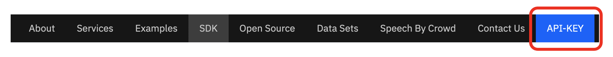

# Project Debater Early Access Program tutorials
## Introduction
Project Debater is the first AI to successfully engage with a human in a live debate. In February 2019, Project Debater debated Mr. Harish Natarajan, one of the world's leading professional debaters in an event held in San Francisco and broadcast live worldwide. The underlying technologies that enabled the live event are now available to you as software services, denoted as Project Debater services, that include core natural language understanding capabilities, argument mining, text summarization and narrative generation. More information on the various services, code examples and online demos can be found at https://early-access-program.debater.res.ibm.com.

When you have a large collection of texts representing people’s opinions (such as product reviews, survey answers or posts from social media), it is difficult to understand the key issues that come up in the data. Going over thousands of comments is prohibitively expensive. Existing automated approaches are often limited to identifying recurring phrases or concepts and the overall sentiment toward them, but do not provide detailed or actionable insights.

In this tutorial you will gain hands-on experience in using Project Debater services for analyzing and deriving insights from open-ended answers. The data we will use is a community survey conducted in the city of Austin in the years 2016 and 2017. We will analyze their open-ended answers in different ways by using four Debater services, the Argument Quality service, the Key Point Analysis service, the Term Wikifier service and the Term Relater service, and we will see how they can be combined into a powerful text analysis tool.

## Prerequisites
To follow this tutorial, you first need to receive credentials for the Debater APIs early-access-program site (https://early-access-program.debater.res.ibm.com) by sending a request email to: `project.debater@il.ibm.com`

## Available tutorials
* The tutorial `survey_usecase` demonstrates how to use Project Debater services for analyzing and finding insights in free text survey data. 
* The tutorial `pro_con_customization` demonstrates how to customize the Project Debater services to specific domains and tasks by fine-tuning the model with user provided examples.  In addition to an APIKEY, this tutorial requires a Docker image of the pro-con service of the Debater Early Access Program. Please contact `eladv@il.ibm.com` for more information.

## Estimated time
It should take about 1 hour to complete the `survey_usecase` tutorial.

## Environment setup
In order to run the tutorials, you need an Python Anaconda environment with the Early Access Program SDK installed on it and a Jupyter notebook.

* Create a conda env: 
`conda create --name <name> python=3.7`

* Activate env: 
`conda activate <name>`

* Get credentials for the Early Access Program site by sending an email to: 
`project.debater@il.ibm.com`

* Login to the Project Debater Early Access Program web site: 
https://early-access-program.debater.res.ibm.com/

* Download and install the Python SDK according to the instructions in: 
https://early-access-program.debater.res.ibm.com/download_sdk.html
  
* To check that the environment is set correctly, try running a code example, e.g.:
https://early-access-program.debater.res.ibm.com/#keypoints

* Get the API-KEY from the site:

## Run the tutorial

* Clone the tutorial repository: 
`git clone https://github.com/IBM/debater-eap-tutorial.git`

* Install the required packages: 
`cd debater-eap-tutorial` 
`pip install -r requirements.txt`

* Run Jupyter Notebook (use the api-key from the site): 
`env DEBATER_API_KEY=APIKEY_PLACE_HOLDER jupyter notebook`

* To check that the environment is set correctly, try running notebook `hello_world/hello_world.ipynb`.

* Open `survey_usecase/austin_demo.ipynb` notebook for a simple hands-on tutorial or `survey_usecase/austin_demo_with_answers.ipynb` for a runnable version.  

* The tutorial is self-explanatory, please follow the instructions and explanations.

* Feel free to contact us if you face problems or have questions at:  `project.debater@il.ibm.com`